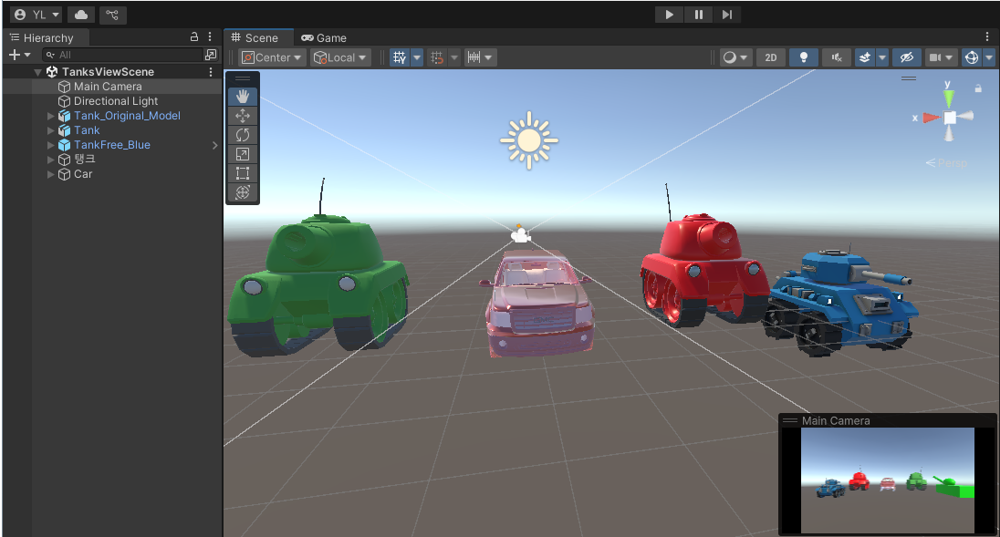
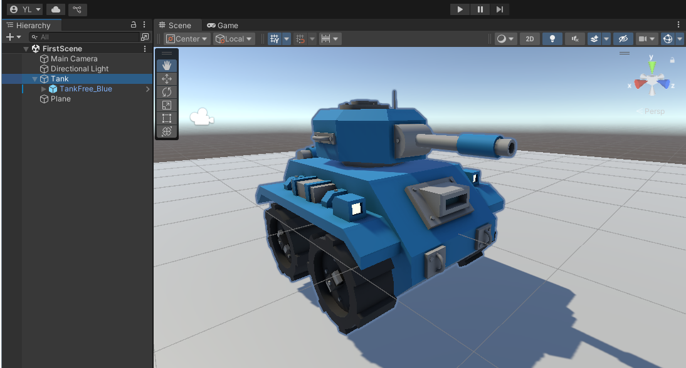

# Unity Game Engine

- 게임엔진이해와실습 (2025-1학기)

### Requirement

[Unity 2021.3.24f1 (LTS)]

실습실 버전과 동일하게 업데이트 예정

### Description

- Unity Scripting (2025.03.25.)

CubeScript, SphereScript : Cube와 Sphere 객체를 생성해서, 스크립트와 객체를 각각 연결

- TankProject (2025.04.08.)

가능한 한, 스크립트와 변수명, 메소드명 등은 교재에 맞춰 작성하도록 해보겠습니다

Tank 객체 생성, 이동 회전 (TankMove.cs 하단 숙제 참조하여 스크립트를 수정해봅니다)

### Scenes

</img>
</img>

